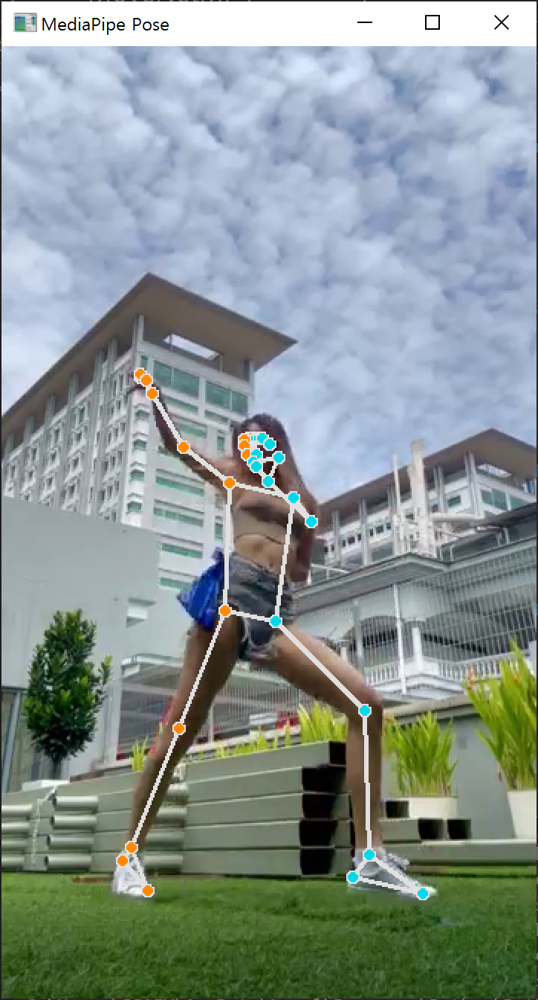
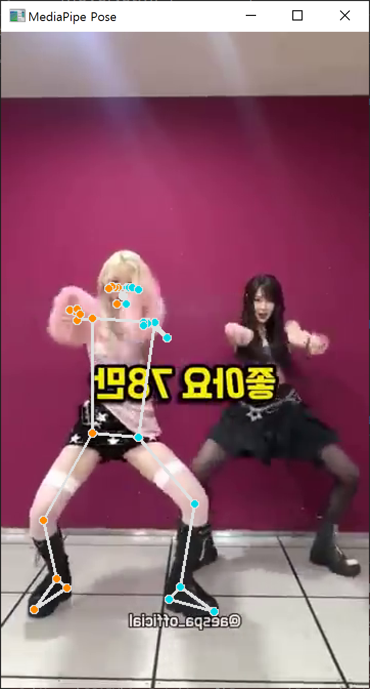

# 24.07.15

### 요구사항 분석 및 정의

1. 회원관리
    - 회원가입
    - 로그인
    - 로그아웃
    - 수정
2. 댄스 튜토리얼 기능
    - 단계
        - 사용자의 모션 인식
        - 스탭 댄스
        - 전신 댄스
3. 검색 기능
    - 강사 검색 : 특정 강사가 춘 영상이 결과로
    - 춤 검색 : 해당 춤과 관련된 영상이 결과로
    - 장르 : 해당 장르와 관련된 영상이 결과로
4. URL을 통한 유튜브 쇼츠 불러오기 기능
    - 이건 뭐 사용자가 올리고 싶은데로
5. 영상의 강사와 자신의 몸 동작을 보여주는 기능
    - 스켈레톤 on/off 기능 제공
6. 몸 동작의 일치율에 따른 정보를 출력하는 기능
    - 50% 밑 : BAD
    - 50% 이상 90% 밑 : GOOD
    - 그 이외 : PERFECT
7. 영상의 속도, 크기를 조절하는 기능
    - 속도
        - 0.5, 0.75, 1, 1.5, 2
    - 크기
        - 원래크기, 3분의2, 2분의1
8. 영상을 마이페이지에 저장하고 다운할 수 있는 기능
    - 저장 시 파일 뭐로 제공 해야하지
9. 강사 등록 기능
    - 어느 정도 역량이 있는 강사를 등록

### 간략한 DB 설계

1. 회원 정보

- 회원 ID
- 회원 PWD
- 회원 닉네임? 이름?
- 가입 날짜
- 회원 프로필 파일명
- 회원 프로필 썸네일?
- 전화번호
- role? → 관리자, 댄서, 일반 사용자
- 주의사항으론 소셜 로그인 ! (나는 해 본 적이 없어서 네이버 로그인이면 네이버의 무슨 정보를 가져올 수 있는지 모름)
- 댄서라면 몇명의 수강생이 있는지? (이런건 구독 서비스 같은게 존재하면 있을 만함)

2. (춤) 강의 상세 정보

- 업로드 영상 파일명
- 업로드 영상 썸네일? (영상썸네일 or 영상 중 이미지 썸네일)
- 강의 제목
- 강의 내용 (간략하게든 자세하게든..)
- 강의 작성 날짜
- 강사 (댄서)
- 조회수
- 좋아요
- 강의 장르? 종류? (이거에 따른 마스터테이블 필요)
- 강의 난이도

3. (챌린지)

- 관련 테이블이 무엇이 필요할까..
- 그래봐야 챌린지 연습한 영상 저장? 이런거 정도? (춤도 이건 필요함)

4. 회원 영상 저장

- id : PK
- userId : FK
- 저장 날짜
- 원본 영상? (shorts → youtube url, dance lesson → lesson url?)
- 저장 영상 종류 (shorts or dance)
- 저장된 영상 파일명
- 저장할 때 제목 (막 아무노래v1, 아무노래v2, 아무노래 최종본.. 이런거 생각한 부분)

5. 추가로 주의사항

- 댄스 장르를 하면 여러 개의 장르의 춤이 있을 수 있음 (정규화가 막 쉽지 않다!)

### MoveNet mp4 파일 테스트

- 1인 영상

  
  - 1인의 경우 인식의 문제는 없어 보임

- 2인 이상 영상

  
  - 설정에 따라 인식되는 사람이 다름
  - 현재 코드는 맨 좌측 사람을 인식하도록 설정되어 있음
  - 여러명이 추는 안무의 경우 문제가 생길것으로 예상됨

- 그리고 좌우반전으로 영상을 다시 추출해 주어서 문제가 있음