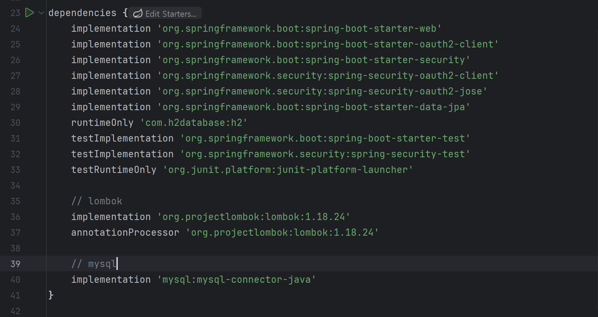
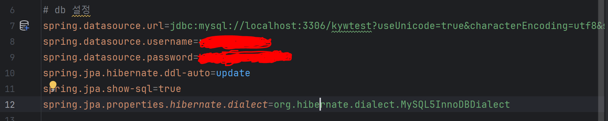
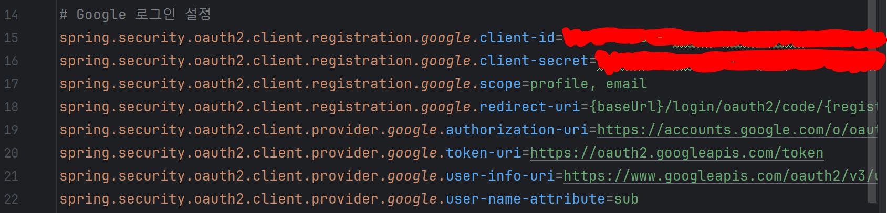
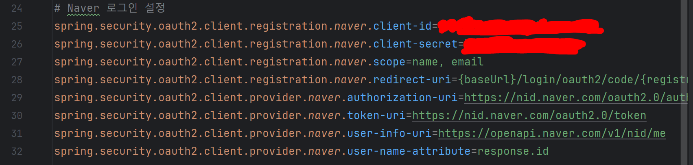
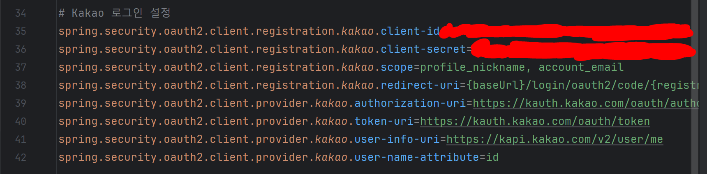
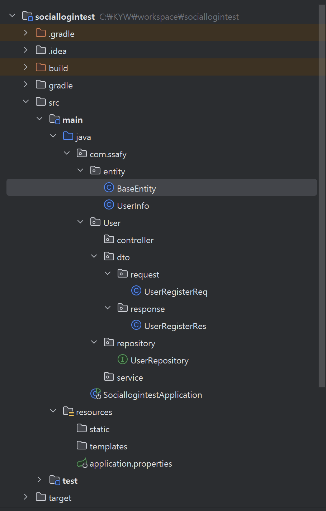

# 24.07.16

### 요구사항 명세서

- [요구사항 명세서.pdf](요구사항%20명세서.pdf)

### 소셜 로그인 설정

- IntelliJ Spring Boot 설치 완료

- build.gradle 설정
    

- application.properties db 설정
    

- application.properties google 설정
    

- application.properties naver 설정
    

- application.properties kakao 설정
    

### 소셜 로그인 테스트 파일 구조 (진행 중)

