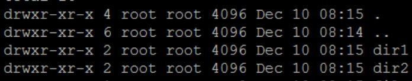

# 24.07.18

### Linux 파일 권한
- chmod를 사용하여 파일 및 디렉토리에 대한 권한을 설정한다

- 

    - drwxr-xr-x 부분
        - 첫 번째가 `d`라면 directory, `-`라면 file, `l`은 링크가 있으며 이 외에도 디바이스들이 존재한다
        - r : 읽기 권한 (4)
        - w : 쓰기 권한 (2)
        - x : 실행 권한 (1)
    - root root 부분
        - 첫 번째 root : 소유자
        - 두 번째 root : 그룹

- chmod o-r file -> 하지만 많이 안 씀! (상대 모드)

- chmod 751 file -> -rwxr-x--x 의 권한이 됨 (절대 모드)

### DB Index

- index가 중요한 이유

    - index가 없다면 full scan(= table scan)으로 데이터를 찾아야 하므로 시간 복잡도는 O(N)
    - index가 있다면 O(logN) (B-tree based index)
    - index를 쓰는 이유
        - 조건을 만족하는 튜플(들)을 빠르게 조회하기 위해!
        - 빠르게 정렬(order by)하거나 그룹핑(group by) 하기 위해

- index 거는 법

    ```sql
    create [unique] index 인덱스명 on 테이블명 (컬럼명);
    ```

    - unique 옵션은 중복이 안되는 고유 인덱스를 생성하는 것
        - 생략하면 중복이 허용

    ```sql
    create table 테이블명 (
        id int primary key,
        name varchar(20) not null,
        team_id int,
        backnumber int,
        index 인덱스명 (컬럼명),
        unique index 인덱스명 (컬럼명들..),
    );
    ```

    - primary key에는 index가 자동 생성됨

- index 조회
    ```sql
    show index from 테이블명;
    ```
- index 주의 사항

    - index가 많다고 좋은건 아님!
    - table에 write할 때마다 index도 변경 발생
        - B-tree일 경우 정렬(트리의 구조 조정)을 해야하므로 많은 시간이 걸릴 수 있음
    - 추가적인 저장 공간 차지
    - 즉, 불필요한 index를 만들지 말자

### ERD
- 소셜 로그인은 구현하지 않기로 함! (oauth와 security 등 학습 시간 부족 판단)
- 자체 회원가입 및 로그인 서비스로 계획 변경!
- challenge를 연습한 영상을 저장할 테이블이 필요해 보여서 추가함
- dancer를 stepper라는 우리 사이트만의 용어로 변경함! (댄스 강사 느낌)
- stepper_info 테이블에서 status를 추가하여 stepper가 되기 위한 지원 중인지, stepper 인지 등의 정보 표시를 위한 컬럼 추가할 예정
- lesson_info에서 thumbnail에 대한 파일 경로 컬럼 추가함
- ERD
    
