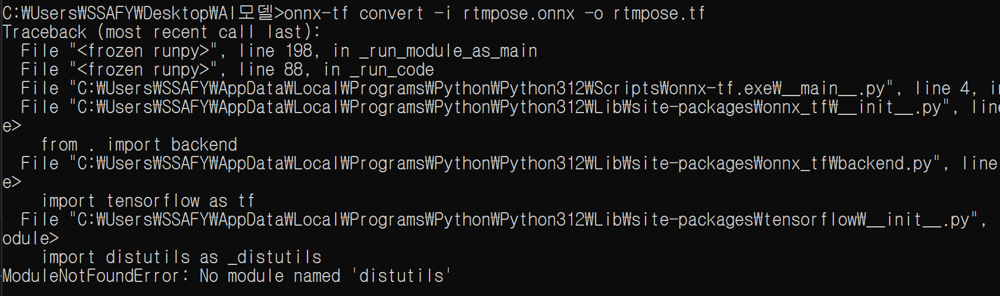
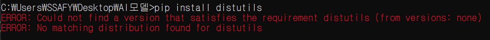
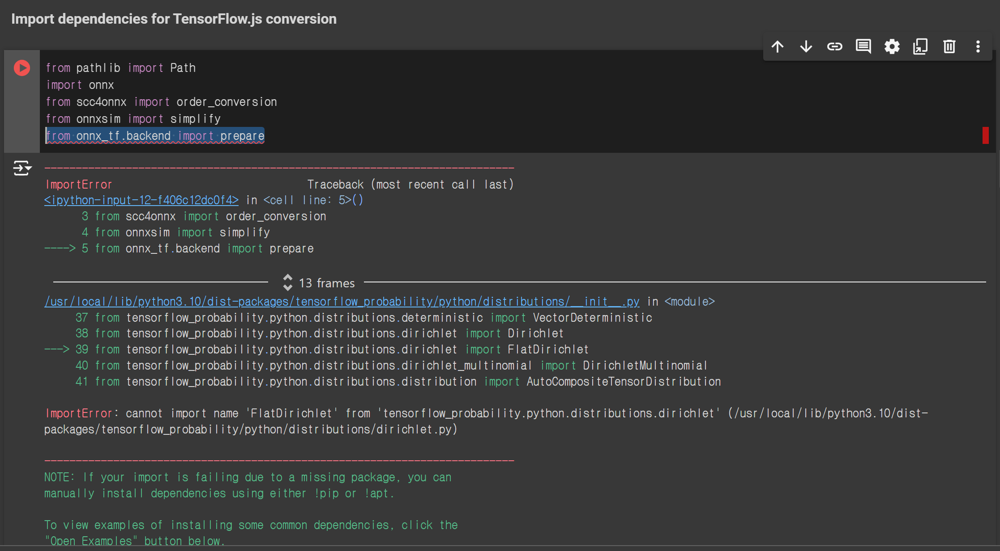
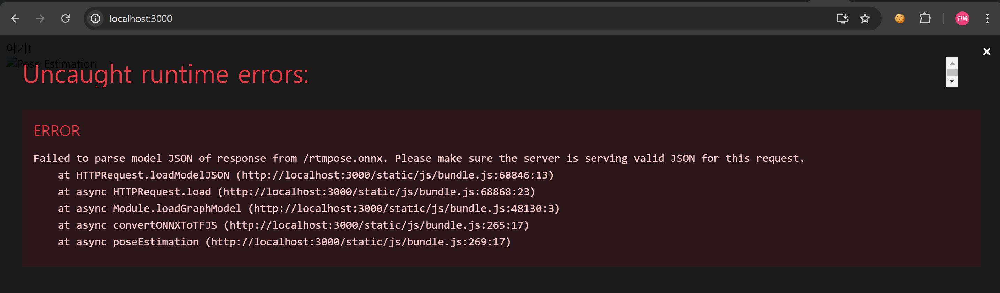

# 24.07.19

### ONNX를 WebAssembly로 변환하기!

- emscripten 설치
    1. git clone https://github.com/emscripten-core/emsdk.git
    2. cd emsdk
    3. git pull
    4. emsdk install latest
    5. emsdk activate latest (Emscripten 환경 활성화)

- 변환 중 문제 상황 발생

    - onnx를 tensorflow 모델로 변환하는 중 import 문제 발생
        

    - 문제에 따른 pip install 하는 데에도 문제 발생
        

    - colab에서 onnx를 tensorflow 모델로 변환하는 중 문제 발생
        

    - react에서 javascript로 onnx를 tensorflow.js 로 변환한 뒤 사용하는 중 오류 발생
        