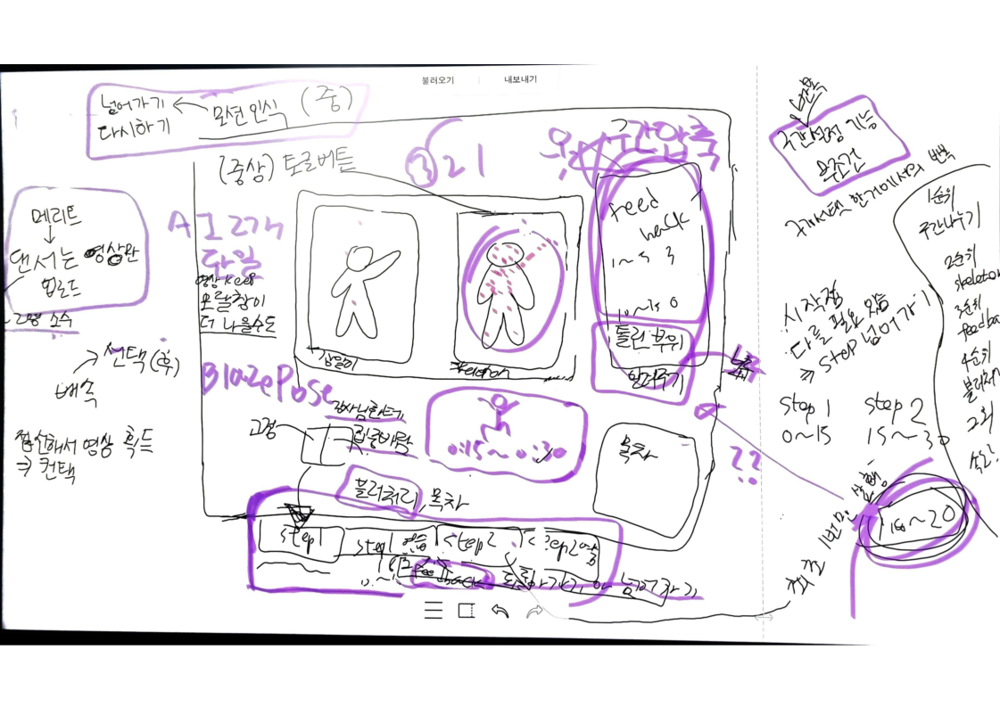
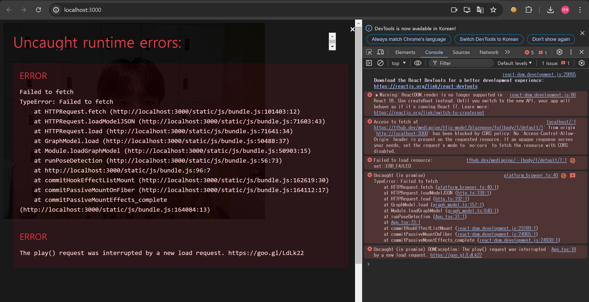
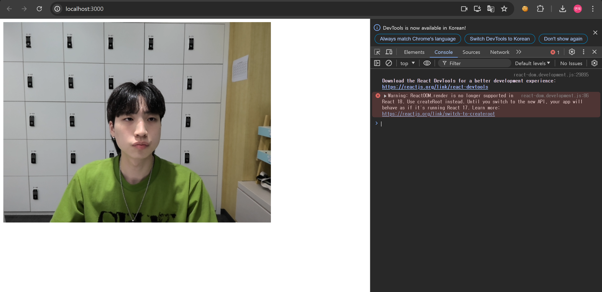

# 24.07.22

### 아이디어 기획 ...!!

- 춤 영상은 1인용 안무로 해당 곡에 대한 춤 전체 분량을 받아서 사용
    1. 영상 다운로드
    2. 댄서에게 받기

- 각 step은 AI를 통해서 나눠서 제공 (현재 마땅한 AI 찾지 못 함...)

- 각 step별 연습 영상 전에 강사 영상만 먼저 한 번 재생하고 사용자 화면은 블러 처리 및 안내 문구 출력

- 강사 영상에는 실물 영상이 나오고 사용자 영상에는 강사 스켈레톤 및 사용자 실시간 화면 출력
    - 위 상황을 디폴트 값으로 하고 스켈레톤 토글 버튼 추가

- 원하는 step에 바로 접근이 가능한 목차 제공

- 춤 연습 중에는 피드백 내용이 비어있다가 춤 연습이 완료된 후에 피드백 내용 업데이트

- 피드백 내용은 일치도를 참고해서 피드백 구간에 대한 영상 제공 및 피드백 내용 출력(부위별)
    - 피드백 영상은 모달창 or 기존 화면 변경
    - 피드백 구간 압축 작업 필요
    - 피드백 영상 확인 말고 피드백 구간 연습은 어떻게 할 지 고민 중

- 모션 인식을 통한 간편 조작
    - 다시 연습하기
    - 다음 step 넘어가기

- 배속 조절은 step 분할로 대체될 수 있을듯
    - 배속하면 스켈레톤 프레임 단위 문제 생길수도

- 가이드라인 관련 춤 연습 전 부분은 7/23(화)에 회의

### Blazepose Test

- react 에러.. (실패 화면)

    

- web cam 띄우기 성공!

    