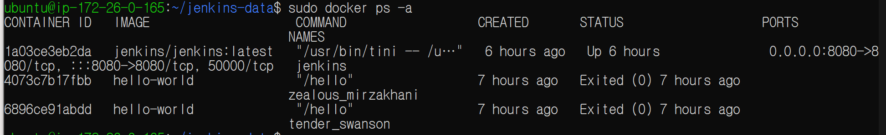
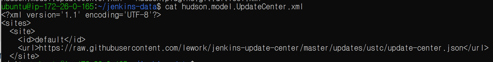
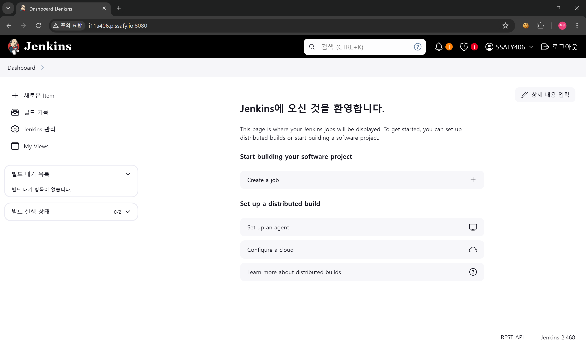
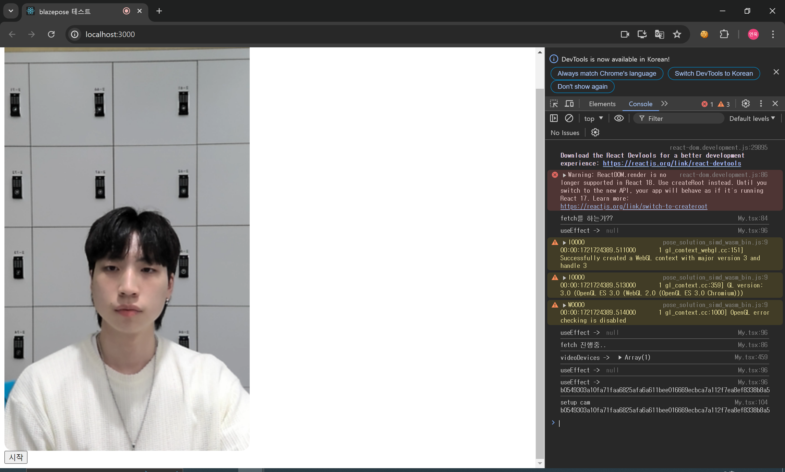
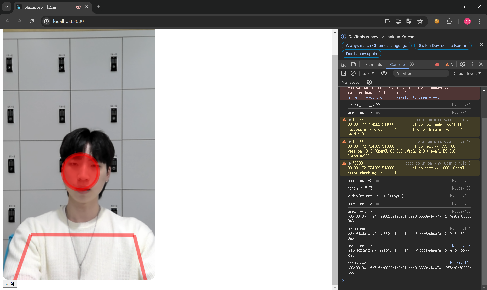
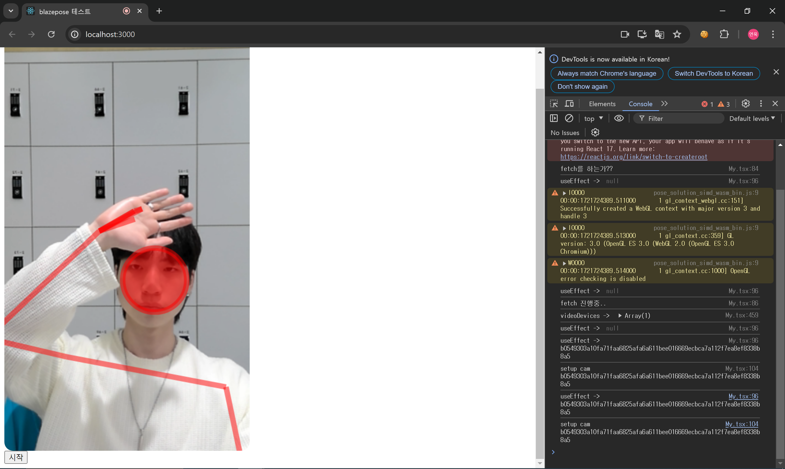

# 24.07.23

### KPT

- Keep
    - 활발한 의견 공유 유지하자! (팀미팅)
    - 지각하지 말자!

- Problem
    - 현재 너무 산출물이 없음! (리스트업, 기획 더 구체화)
    - 교육을 버린 것이 맞는가? 사실상 교육의 방향으로 가고 있다 (대상이 바뀌었을 뿐, 교육의 깊이를 줄였을 뿐!)

- Try
    - 지금의 아이디어를 리스트업 해서 더 구체화 하기
    - 구체화 하면서 필요한 부분(기능, 자료)을 더 생각하기
    - AI 모델 테스트 그만. 그냥 모든 걸 같이 하자!
    - 하고 싶은 서비스가 먼저 나와야 함!!!!

### Jenkins 설정

- ufw 설정

    

- docker container

    

- jenkins 미러 사이트 설정

    

- jenkins site (버전 문제로 인해 업그레이드 함)

    

### Blazepose Typescript 테스트 (react)

- 문제점 : 프레임이 너무 끊기는 느낌 (해결책을 찾아야 함..!)