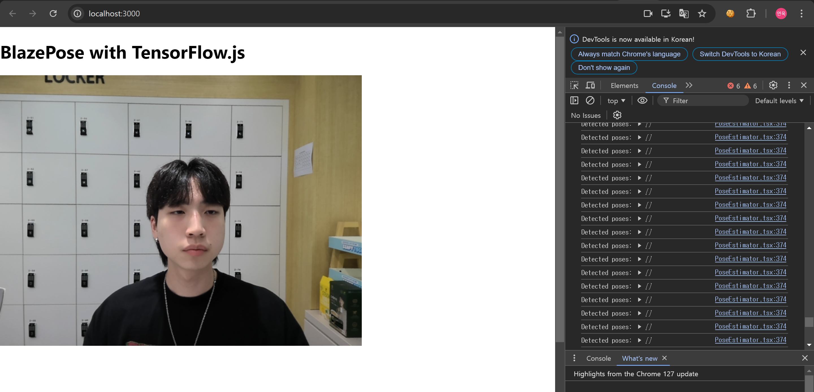

# 24.07.26

### KPT

- Keep
    - 게임적인 부분을 매우 잘 살려야 함!
    - 리스트업도 매우 좋다!

- Problem
    - 손가락까지의 인식은 힘들 것으로 예상됨
    - 웹이다 보니 컴퓨터와 캠이 필요한 부분이 생김 (모바일로 하면 어땠느냐는 의견)

- Try
    - 모바일 측면의 UI/UX도 한 번 생각해 보기! (더 작은 화면이기 때문에 매우 중요한 부분)
    - 손가락까지의 인식을 최대한 해 보기 (하지만 게임이기 때문에 완전 정확한 인식보다는 중요 포인트의 인식률을 높여도 좋을 것 같음)
    - 우선순위 세우기
    - React Blazepose 테스트

### react blazepose

- 문제점
    - 클라이언트가 cpu를 사용하여 인식을 하면 프레임이 매우 끊겨서 인식됨
    - 크롬의 경우 하드웨어 가속화 설정을 키게 된다면 GPU 사용으로 이를 해결할 수 있을 것으로 보임
    - 다만 이러면 크롬에 제한된다는 문제가 생김
    - 심지어 제대로 인식이 되지 않는 부분 발생
        

