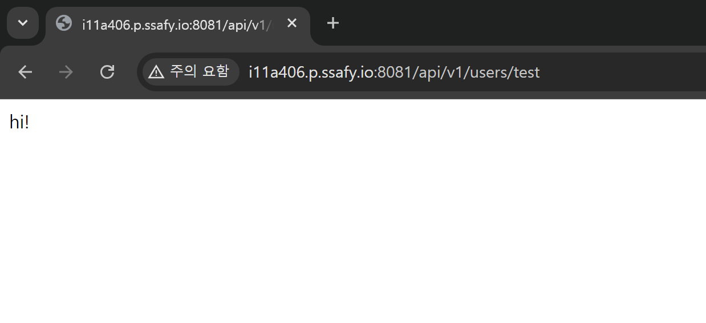

# 24.07.31

### KPT

- Keep
    - AI 모델 테스트 (Blazepose)
    - Blazepose 코드 학습하기
    - EC2 Docker로 배포

- Problem
    - MySQL DB는 RDS를 사용해야 하나, docker로 띄워야 하나, ec2에 그냥 설치해서 띄워야 하나의 문제

- Try
    - docker로도 띄워 보기
    - RDS는 필요성을 따져본 뒤 시간이 남으면 도전
    - jenkins 학습하기
    - jenkins pipeline 구축

### Backend 코드
- 현재 임시로 기본 코드 배포 (배포 테스트를 위함)
- db 설정 변경
    - jdbc:mysql://i11a406.p.ssafy.io:3306/danstep_db?serverTimezone=UTC&characterEncoding=UTF-8
    - 계정 및 비밀번호 또한 변경

### Infra (EC2)
- Spring Boot - Docker
    1. docker desktop (window) 설치
    2. ec2 (ubuntu)에 필요한 패키지 설치
    3. Dockerfile 생성
    4. gradle 빌드
    5. 도커 이미지 빌드
    6. 도커 허브로 이미지 업로드
    7. EC2 에서 도커 pull
    8. EC2 에서 도커 run
    9. ufw 설정 (8081/tcp 포트 활성화!!)

- MySQL - EC2
    1. mysql 설치
    2. MySQL 실행
    3. MySQL 접속
    4. MySQL 초기 접속 설정
    5. ufw 설정 (3306/tcp 포트 활성화!!)
    6. MySQL bind-address **설정 변경** (0.0.0.0) 
    7. 추가 설명
        1. 스프링부트에서 db주소를 localhost로 한다면 컨테이너 안으로 잡히게 된다
        2. 즉 서버에서(ec2)띄운 mysql에 접근하는 것이 아님
        3. 서버의 mysql에 접근하기 위해 3306 열어준 것

- 최종 테스트 화면
    

