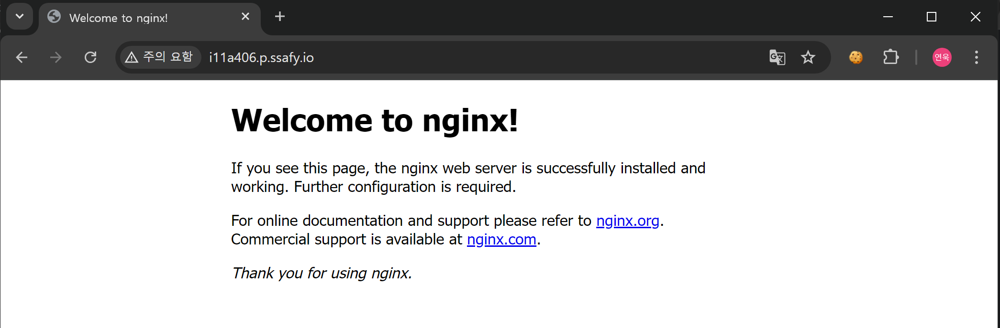
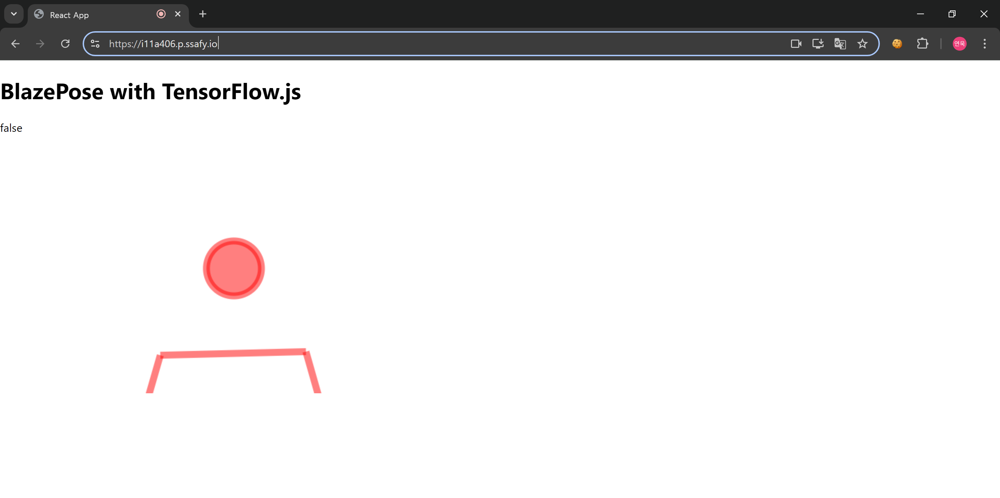
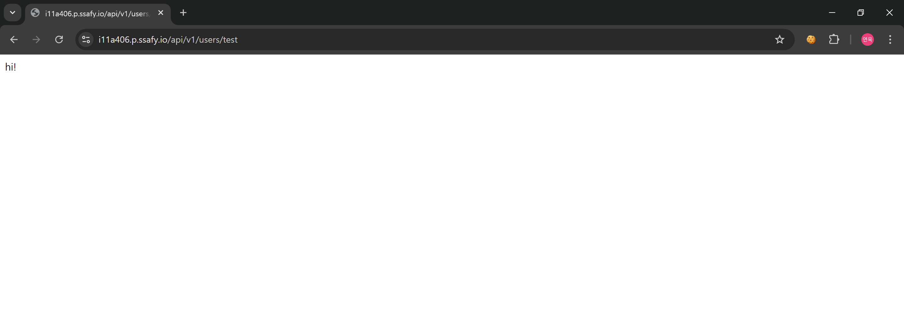
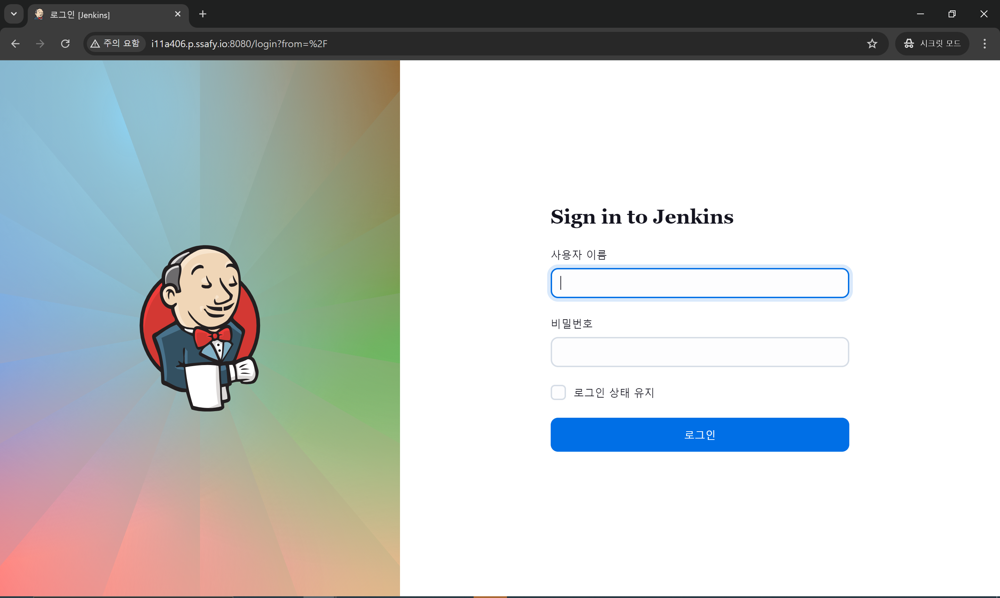

# 24.08.01

### KPT

- Keep
    - React Docker 배포
    - Nginx Docker 배포
    - Jenkins 설정

- Problem
    - Jenkins를 처음 쓰다 보니 설정 하는 법을 잘 모르겠음!
    - 사람들마다 설정하는 법이 다 다르니 무작정 따라해선 안 됨

- Try
    - Jenkins 설정
    - DB ERD 설계
    - DB Table Setting (JPA로 할 지, dump 파일로 할 지 정하기)

### Nginx 설정

1. nginx 설치
2. SSL - certbot 설치
3. SSL - 인증서 발급 
4. certbot - 자동 갱신
    
### React, Nginx Docker 배포

1. react build
2. Dockerfile 생성
    ```
    # 단계 1: 빌드 이미지 생성
    # 최신 LTS 버전 사용
    FROM node:lts AS build
    
    # 작업 디렉토리 설정
    WORKDIR /app
    
    # 패키지 파일 복사
    COPY package.json ./
    COPY package-lock.json ./
    
    # 의존성 설치
    RUN npm install
    
    # 애플리케이션 소스 코드 복사
    COPY . .
    
    # 애플리케이션 빌드
    RUN npm run build
    
    # 단계 2: Nginx 이미지 생성
    FROM nginx:alpine
    
    # Nginx 설정파일 복사
    COPY nginx.conf /etc/nginx/nginx.conf
    
    # 빌드된 React 애플리케이션을 Nginx의 기본 HTML 디렉토리로 복사
    COPY --from=build /app/build /usr/share/nginx/html
    
    # SSL 인증서와 키 파일을 복사 (필요한 경우)
    # COPY ./path/to/certificates/fullchain.pem /etc/ssl/certs/fullchain.pem
    # COPY ./path/to/certificates/privkey.pem /etc/ssl/private/privkey.pem
    # 이 부분은 아마도 docker volume을 이용해서 해결함!
    
    # 컨테이너가 80 포트를 사용할 수 있도록 설정 (HTTP)
    EXPOSE 80
    # 컨테이너가 443 포트를 사용할 수 있도록 설정 (HTTPS)
    EXPOSE 443
    
    # Nginx 실행
    CMD ["nginx", "-g", "daemon off;"]
    ```
    
3. docker build & push
    
    ```bash
    > docker build -t danstep/fe_image:1.0 .
    
    > docker tag danstep/fe_image:1.0 kimyeonwook/fe_image:1.0
    
    > docker push kimyeonwook/fe_image:1.0
    ```
    
4. ec2 - docker pull
    
    ```bash
    $ sudo docker pull kimyeonwook/fe_image:1.0
    ```
    
5. docker 컨테이너 실행
    
    ```bash
    $ sudo docker run -d \
      -p 80:80 \
      -p 443:443 \
      --name danstep_fe_v1 \
      -v /etc/letsencrypt/live/i11a406.p.ssafy.io/fullchain.pem:/etc/letsencrypt/live/i11a406.p.ssafy.io/fullchain.pem \
      -v /etc/letsencrypt/live/i11a406.p.ssafy.io/privkey.pem:/etc/letsencrypt/live/i11a406.p.ssafy.io/privkey.pem \
      kimyeonwook/fe_image:1.0
    ```

### 중간 테스트
- nginx (EC2에서 띄워서 테스트)
    

- SSL 설정으로 HTTP로 요청해도 HTTPS로 Redirect됨!!

- nginx proxy - react
    

- nginx proxy - spring boot
    

- jenkins
    